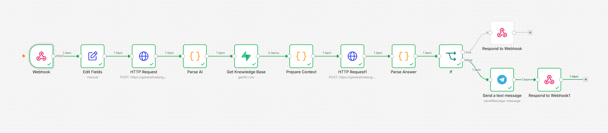
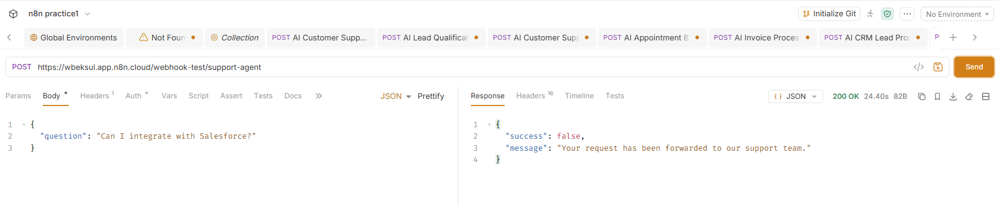
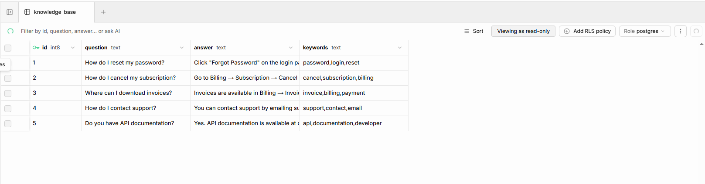
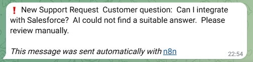

# AI Customer Support Agent with Knowledge Base

An AI-powered customer support assistant built with **n8n**, **Google Gemini AI**, and **Supabase**.

The workflow automatically answers customer questions using a knowledge base, escalates unknown requests to human support, and returns structured API responses.

---

# Overview

This workflow demonstrates how to build an AI customer support system without writing a backend application.

Features:

- Receives customer questions via Webhook
- Uses Gemini AI to analyze the request
- Searches a knowledge base stored in Supabase
- Generates an answer based only on company knowledge
- Escalates unanswered questions to a human
- Sends Telegram notifications
- Returns structured JSON responses

---

# Business Problem

Support teams receive the same questions every day:

- How do I reset my password?
- How do I cancel my subscription?
- Where can I find invoices?
- Do you have API documentation?

Answering repetitive questions manually wastes time and slows response times.

This workflow automates the first level of customer support.

---

# Solution

Customer Question

↓

Webhook

↓

Gemini AI (Question Analysis)

↓

Parse JSON

↓

Supabase Knowledge Base

↓

Prepare Context

↓

Gemini AI (Generate Answer)

↓

Parse Answer

↓

IF Answer Found

├── TRUE
│
│ Respond to Webhook
│
└── FALSE
│
Telegram Notification
│
Respond to Webhook

---

# Technologies

- n8n
- Google Gemini AI
- Supabase
- Telegram Bot API
- JavaScript
- REST API
- JSON
- Webhooks

---

# Features

- AI question understanding
- Knowledge Base search
- AI-generated responses
- Customer support automation
- Human escalation
- Telegram alerts
- JSON API responses
- Error handling

---

# Workflow

## 1. Receive Question

Customer sends a support question using a Webhook.

---

## 2. AI Analysis

Gemini extracts:

- Question
- Keywords
- Category
- Confidence

---

## 3. Knowledge Base

The workflow loads company knowledge from Supabase.

Example topics:

- Password reset
- Subscription cancellation
- Billing
- API documentation
- Support contact

---

## 4. AI Answer Generation

Gemini receives:

- Customer question
- Knowledge base

It returns:

- Answer
- Found (true/false)
- Confidence

---

## 5. Decision

If an answer exists:

- Return the answer to the customer.

Otherwise:

- Notify the support team in Telegram.
- Return a message informing the customer that the request has been forwarded.

---

# API Example

Request

```json
{
  "question": "How do I reset my password?"
}
```

Successful Response

```json
{
  "success": true,
  "answer": "Click \"Forgot Password\" on the login page and follow the instructions sent to your email.",
  "confidence": 100
}
```

Escalation Response

```json
{
  "success": false,
  "message": "Your request has been forwarded to our support team."
}
```

---

# Screenshots

## Complete Workflow



---

## Webhook Test



---

## Supabase Knowledge Base



---

## Telegram Escalation



---

# Skills Demonstrated

- AI Automation
- AI Agents
- Knowledge Base Systems
- Prompt Engineering
- Workflow Automation
- REST APIs
- JavaScript
- Webhooks
- Supabase
- Business Process Automation

---

# Business Value

- Reduces repetitive support work
- Improves response time
- Ensures consistent answers
- Automatically escalates unknown requests
- Provides a scalable customer support workflow

---

# Author

Built by Farangiz as part of an AI Automation Engineer portfolio.
